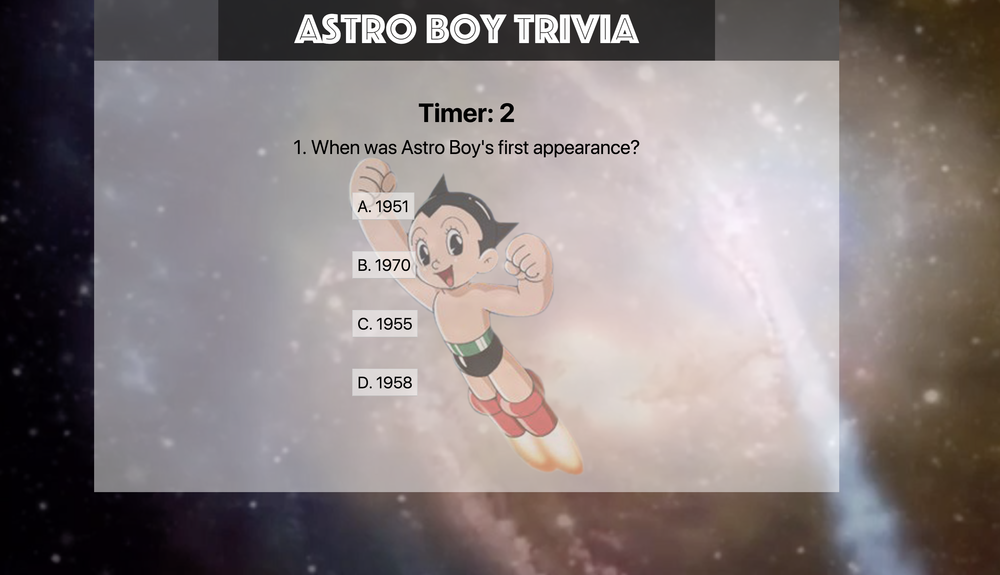

# astroBoy

## Using javascript/jquery, hmtl/css, bootstrap, video/audio and demonstration of timer, and javascript objects ASTROBOY trivia game was created.

1. User will be given 10 seconds to pick an answer.
2. If correct, the user will be notified that the answer is correct, add points to user scores, move on to the next question and reset the timer.
3. If its wrong the user will be notified that the answer is wrong, move on to the next question, not add points to score.
4. Else if user didn't not choose. The user will be notified that the time is up, automatically move on to the next question and reset the timer to start again.
5. At the end of the trivia game, the user will shown the total points he/she accrued and an option to play again.

### Check me out: [astroboy](https://joycedelatorre.github.io/astroBoy/)

